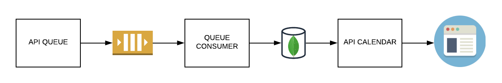

# Contributing

How contribute with this project is very easy.

1. Open a Issue with a full description with what is wanted to be done.
2. Start codding with an IDE which can use "editorconf"
3. Use our standards
4. Follow Solid and Golang Stand Projects
5. After finished your code, please send a pull request to master

## IDE Dependencies

* [Editorconfig](https://editorconfig.org/)

## Golang Dependencies

* [Realize](https://github.com/oxequa/realize), a Golang Task Runner;
* [Dep](https://golang.github.io/dep/), a Golang package manager, "go mod" sucks;

## Arch Dependencies(

* [Prisma Cli](https://www.prisma.io), Prisma is a ORM and it's cli will be used a lot.

## DEV Designs

* [Solid](https://scotch.io/bar-talk/s-o-l-i-d-the-first-five-principles-of-object-oriented-design), please adapt class to package and let it go;
* [Golang Standards Project Layout](https://github.com/golang-standards/project-layout) will used as folders organizations;

## Arch Overview



## Start Coding

### DEV Enviromoment

```sh
make packages
```

#### DEV Running

```sh
make dev
```
